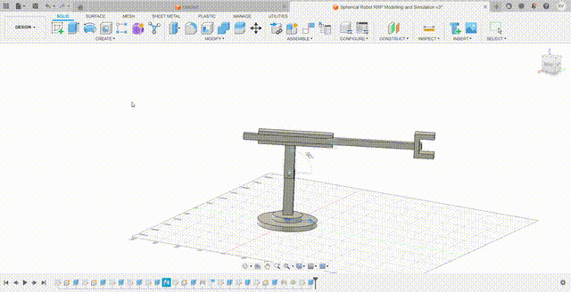
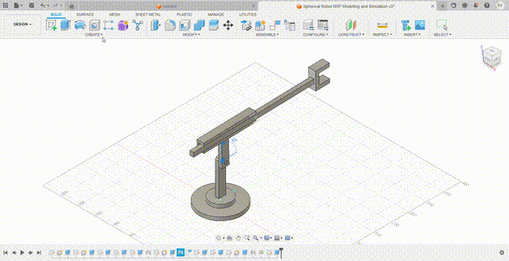
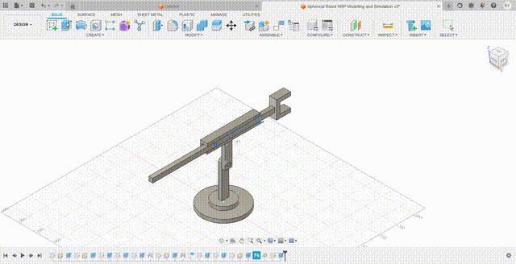
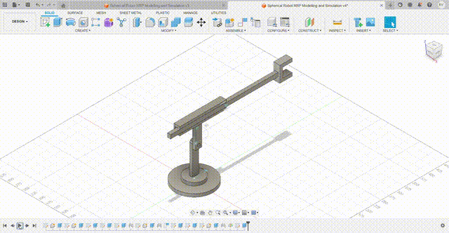

# Modelling and Simulation of a Spherical | Polar Robot 🤖

This repository contains the implementation of the project titled _"Modelling and Simulation of a Polar Robot"_, at the Department of Mechatronics Engineering (DOME), Federal University of Technology Minna (FUTMinna), Nigeria.

---

## 🔍 Project Overview

Robotics has emerged as a transformational field that integrates mechanical, electrical engineering and computer science to create autonomous machines. The spherical robot is one of the various robotic designs available today, with its unique structure where the three joints typically feature a revolute-revolute-prismatic (RRP) configuration with intersecting axes, enabling a spherical workspace. This robot configuration is valued for its agility in automation and exploration, amongst other uses. Therefore, the purpose of this project is to model and simulate the kinematics of a spherical robot with an RRP configuration.

---

## 🧩 Project Objectives

- To design a representative model for the spherical | polar robot configuration with revolute-revolute-prismatic (RRP) configuration.
- To simulate the motions of the modelled robot at each of the joints using specified angles.

---

## 🌀 Modelling and Simulation

### Modelling of the Spherical | Polar Robot

The modelling of the spherical (RRP) robot was done using Autodesk Fusion 360, a cloud-based CAD/CAM software. This tool was selected due to its 3D modeling capabilities, including parametric design, assembly management, and motion simulation, which was necessary for designing the spherical robot. 

### Joint Configuration
As established in earlier sections, the 3D-modeled robot’s structure is defined by three primary joints, often referred to as the RRP (Revolute-Revolute-Prismatic) configuration.

- The first joint (revolute) positioned at the base enables a full 360-degree rotation around the vertical axis. It provides the robot with azimuthal movement, allowing free movement in the horizontal plane.
- The second joint (revolute) is located after the first joint. This revolute joint offers a 270-degree rotation while enabling elevation adjustments in tilting upward or downward within this range.
- The third joint (prismatic) introduces a linear translation along the radial direction, with a range of 180 degrees, allowing the end-effector to extend or retract.

### 🪜 Development Procedure
The modeling process was systematic and involved the following key steps:

**i. Base Design:** The base was modeled first to establish a stable foundation capable of supporting the robot’s weight and dynamic movements. 

**ii. Joint Integration:** Each joint was designed and incorporated sequentially. The revolute joints were aligned to their respective rotational axes, and the prismatic joint was configured for linear motion, with constraints applied to ensure accurate functionality.

**iii. Link Design:** The links connecting the joints were modeled to maintain structural integrity while accommodating the full range of motion for each joint. 

**iv. Assembly:** All components were combined into a final assembly. Special attention was paid to defining the joint limits (360°, 270 °, and 180 °, respectively) and checking for potential collisions between moving parts. 

### Additional Features

Some features of Autodesk Fusion 360 leveraged during the modeling process include: 

- **Parametric Design:** This allowed for quick adjustments to dimensions and joint parameters, enabling design flexibility.
- **Motion Study:** This was performed to validate the range of motion for each joint and ensure smooth, realistic operation. 
- **Collision Detection:** This tool helped identify and eliminate any interference between components during movement.

---

## Results

### 🎥 Model Simulation for the First Revolute Joint

    
     
    <em> Model Simulation for the First Revolute Joint</em>

### 🎥 Model Simulation for the Second Revolute Joint

    
     
    <em> Model Simulation for the Second Revolute Joint</em>

### 🎥 Model Simulation for the Prismatic Revolute Joint

    
     
    <em> Model Simulation for the Prismatic Joint</em>

### 🎥 Demo of the Step-by-Step Procedure Towards the Model Development

    
     
    <em> Model Simulation for the Prismatic Joint</em>

### 📷 Different Views of the Robot

  
  
  
     
    <em> Pictorial Representation of the End Effector Formation (Left), Isometric View of the Robot (Center), and the Side View of the Robot and It's Dimensions (Right)  </em>

---

## ⚠️ Challenges Encountered

A significant challenge encountered was aligning the prismatic joint’s linear motion with the rotational axes of the revolute joints. Misalignment could disrupt the robot’s kinematics, so this was resolved by defining the joint constraints and utilizing fusion 360’s alignment tools to ensure coordination. 

---
